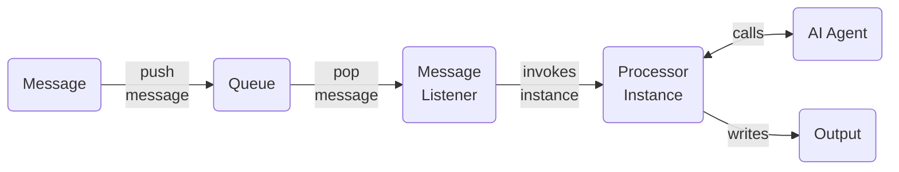

# sDIPs

## Overview

sDIPs is a Python application for generating and processing messages using AI agents and a message queue system. It leverages Azure OpenAI for language tasks and RabbitMQ for message queuing.

## Architecture

- **Command-Line Interface (CLI):** Built with `click`, provides commands to generate, process, count, and clear messages in the queue, as well as mock transcript generation.
- **AI Agents:** Modular agents for transcript generation and translation, built on a common base and using Azure OpenAI.
- **Processors:** Handle messages from the queue, invoke agents, and manage file output.
- **Services:** Abstractions for queue (RabbitMQ), file operations, logging, and Azure OpenAI integration.
- **Message Types:** Typed dataclasses for structured message passing.

### System Architecture Diagram




## Main Components

### CLI (`main.py`, `cmd/rootcmd.py`)
- Entry point: `main.py` runs the CLI.
- Commands:
  - `generate`: Create analysis messages and enqueue them.
  - `process`: Process messages from the queue using appropriate processors.
  - `count`, `clear`: Queue management.
  - `mock_transcript`: Generate a sample transcript using the AI agent.

### AI Agents (`aiagents/`)
- `AIAgentBase`: Abstract base for all agents, handles message formatting and completion via Azure OpenAI.
- `TranscriptGenerationAgent`: Generates transcripts from prompts.
- `ChineseTranslationAgent`: Translates text from English to Chinese.

### Processors (`processors/processors.py`)
- `AnalysisProcessor`: Generates a transcript and its Chinese translation, saves both to file.
- `TranscriptionProcessor`: Handles transcription messages (implementation similar to analysis).

### Services
- `azureopenaiservice.py`: Wraps Azure OpenAI chat completion API.
- `queueservice.py`: Manages RabbitMQ queues for message passing.
- `fileservice.py`: Appends results to a log file.
- `logservice.py`: Configures logging.

### Message Types (`messagetypes/messages.py`)
- `AnalysisData`, `TranscriptionData`: Data payloads for messages.
- `Message`: Envelope for queue messages, includes type, data, unique ID, and timestamp.

## Dependencies

- Docker
- RabbitMQ from Docker Hub
- uv package and project manager
- Python 3.11+
- click
- dataclasses-json
- openai
- pika
- python-dotenv

## `.env` file

Create an an `.env` file with the following settings:

```
AZURE_OPENAI_ENDPOINT=https://<NAME>.openai.azure.com/
AZURE_OPENAI_API_KEY=<API_KEY>
AZURE_OPENAI_VERSION=2025-01-01-preview
AZURE_OPENAI_MODEL=gpt-4o
```

## Usage

1. **Install dependencies:**
   ```
   uv sync
   ```
2. **Run the CLI:**
   ```
   uv run main.py --help
   ```
3. **Example commands:**
   - Generate messages: `uv run main.py generate --count 5`
   - Process messages: `uv run main.py process`
   - View queue count: `uv run main.py count`
   - Clear queue: `uv run main.py clear`
   - Generate a mock transcript: `uv run main.py mock_transcript`
4. **Docker Compose -- RabbitMQ**
   - In development execute: `docker compose up -d`

## Configuration

- Azure OpenAI and RabbitMQ settings are managed in the `services/settingservice.py` (not shown here).
- Output is logged to `data.log`.

---
